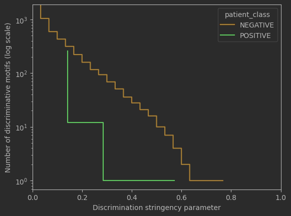

# Context-dependent Identification of Spatial Motifs (CISM)

### Description
Python package contains the code and a demo notebook on public dataset MIBITOF-TNBC (Keren, Leeat et al.
Cell, Volume 174, Issue 6, 1373 - 1387.e19).)

CISM is a two-step method to identify local interconnected cell structures associated with a disease state in single cell spatial proteomics data.

### Installation and Dependencies

#### Prerequisite

1. Python 3.9
2. FANMOD+ binary (https://github.com/zaritskylab/FANMODPlus)

#### Prepare virtual environment

1. python3 -m venv venv
2. activate venv (windows: venv\Scripts\activate, linux:source venv/bin/activate)
3. python3 -m pip install requests

### Prepare dataset for analysis
In order to analyze the proteomics data, we need to convert patients field of view (FOV) to a graph and stores the graphs into a folder.
Folder structure (with 1..n patients and 1..f field-of-view):
- data
  - Dataset Name
    - Patient_1_FOV1.txt
    - Patient_2_FOV2.txt
    - ...
    - ...
    - Patient_\<n>_FOV\<f>.txt
    - patient_class.csv

#### Patient_\<i>_FOV\<k>.txt format
Each field-of-view file should be in the following format:
<src cell id> <dst cell id> <src cell color id> <dst cell color id>
.....
<src cell id> <dst cell id> <src cell color id> <dst cell color id>

For example assume the following adjacency matrix:

    0 1 1
    1 0 0
    1 0 0

with nodes colors:

    color[0] = 0
    color[1] = 1
    color[2] = 2

The matrix should be represented as colord edge list:

    0 1 0 1
    1 0 1 0
    2 1 2 1
    1 2 1 2

#### patient_class.csv format
CISM method support two classes type:
1. Binary (string)
2. Continues (int/float) -> later on will be quantized to binary

The format of each patient class:

    <disease tag><patient id>, <class>

For example:

    TNBC1, POSITIVE
    TNBC2, NEGATIVE

or when the class is continues value of survival days:

    TNBC1, 2612
    TNBC2, 3822

### Find discriminative motifs in nutshell
##### TL;DR For more comprehensive explanation please refer to TNBC notebook demo under the demo folder

#### Initiate CISM class with the configuration:

    cism = CISM(fanmod_exe=<fanmod+ binary name>,
                fanmod_path=<fanmod+ path>,
                network_dataset_root_path=<the path to datasets root dir>,
                fanmod_output_root_path=<fanmod+ output directory>,
                fanmod_cache_root_path=<fanmod+ postprocessing directory>,
                motif_size=<motif size>,
                iterations=<number of random networks for subgraph significant check>)

#### Loading dataset:

    cism.add_dataset(dataset_folder=<relative dataset folder>, 
                     dataset_type=<dataset type name>, 
                     dataset_name=<dataset name>, 
                     force_run_fanmod=<whether to override fanmod+ existing results>, 
                     force_parse=<whether to override existing parse files of fanmod+ outputs>, 
                     n_jobs=<number of jobs allows running in parallel>)

#### Initiate discriminator:

    discriminator = TissueStateDiscriminativeMotifs(cism=<CISM object>,
                                                    tissue_state_csv_path=<path to patient class csv file>,
                                                    tissue_state_to_string=<for binary class, dict from raw class to string>,
                                                    common_cells_type=<cell types dict>,
                                                    tissue_state_func=<for continues class type, function that map int/float to class>)

    In case of continues class type (see above), tissue_state_to_string should set to None.

    common_cells_type: the format of the dictionary mapping

    cells_type = {
     <network color id>: <cell type name>,
     ....
     ....
     <network color id>: <cell type name>,
    }

#### Direct discovery of discriminative motifs (without leave-one-out process):

    discover_result = discriminator.discover(extract_by=<DiscriminativeFeatureKey>, 
                                             classes=<list of classes>)
    
extract_by with DiscriminativeFeatureKey.STRUCTURE_AND_CELL_IDENTITIES use motif canonical representation to discriminate.

#### Plot number of discriminative motifs versus discrimination stringency parameter:

    discover_result.plot_number_of_motifs_versus_discrimination_stringency_parameter(class_to_color=<dict dieases class to color>)

#### Show summary table of all the extracted discrimination motifs
discover_result.discriminative_motifs will plot the full dataframe with all the extracted discriminative motifs
    
    idx,Patient,FOV,ID,Freq,Count,Mean_Freq,STD,z_score,p_value,motif,nunique_colors,Disease,Patient_uId,colors_vec,colors_vec_hash,patient_class,patient_count,patient_percentage
    3,10,FOV10,7722444,0.025521,1321,0.019233,0.000694,9.0653,0.000,gASVMAEAAAAAAACMGG5ldHdvcmt4LmNsYXNzZXMuZGlncmFwaJSMB0RpR3JhcGiUk5QpgZR9lCiMBWdyYXBolH2UjAVfbm9kZZR9lChLAX2UjAR0eXBllIwBM5RzSwJ9lGgKjAIxNJRzSwN9lGgKjAIxNJRzdYwEX2FkapR9lChLAX2USwJ9lIwFbGFiZWyUjACU...,2,TNBC,TNBC10,"[0, 0, 0, 1, 0, 0, 0, 0, 0, 0, 0, 0, 0, 0, 2, 0]",-3729389300718233172,NEGATIVE,4,0.133333
    10,10,FOV10,26596812,0.007419,384,0.003551,0.000309,12.5370,0.000,gASVMQEAAAAAAACMGG5ldHdvcmt4LmNsYXNzZXMuZGlncmFwaJSMB0RpR3JhcGiUk5QpgZR9lCiMBWdyYXBolH2UjAVfbm9kZZR9lChLAX2UjAR0eXBllIwCMTKUc0sCfZRoCowCMTSUc0sDfZRoCowCMTSUc3WMBF9hZGqUfZQoSwF9lEsCfZSMBWxhYmVslIwA...,2,TNBC,TNBC10,"[0, 0, 0, 0, 0, 0, 0, 0, 0, 0, 0, 0, 1, 0, 2, 0]",-4991885778241402576,NEGATIVE,4,0.133333
    63,10,FOV10,5592396,0.000966,50,0.000581,0.000112,3.4252,0.000,gASVMAEAAAAAAACMGG5ldHdvcmt4LmNsYXNzZXMuZGlncmFwaJSMB0RpR3JhcGiUk5QpgZR9lCiMBWdyYXBolH2UjAVfbm9kZZR9lChLAX2UjAR0eXBllIwBMpRzSwJ9lGgKjAIxMJRzSwN9lGgKjAIxMJRzdYwEX2FkapR9lChLAX2USwJ9lIwFbGFiZWyUjACU...,2,TNBC,TNBC10,"[0, 0, 1, 0, 0, 0, 0, 0, 0, 0, 2, 0, 0, 0, 0, 0]",-774791192153669712,NEGATIVE,9,0.300000
    94,10,FOV10,6048076,0.000657,34,0.000203,0.000072,6.2723,0.000,gASVLQEAAAAAAACMGG5ldHdvcmt4LmNsYXNzZXMuZGlncmFwaJSMB0RpR3JhcGiUk5QpgZR9lCiMBWdyYXBolH2UjAVfbm9kZZR9lChLAX2UjAR0eXBllIwBMpRzSwJ9lGgKaAtzSwN9lGgKjAIxMJRzdYwEX2FkapR9lChLAX2UKEsCfZSMBWxhYmVslIwAlHNL...,2,TNBC,TNBC10,"[0, 0, 2, 0, 0, 0, 0, 0, 0, 0, 1, 0, 0, 0, 0, 0]",1304415446218764995,NEGATIVE,12,0.400000
    111,10,FOV10,18199980,0.000502,26,0.000052,0.000055,8.1978,0.000,gASVMAEAAAAAAACMGG5ldHdvcmt4LmNsYXNzZXMuZGlncmFwaJSMB0RpR3JhcGiUk5QpgZR9lCiMBWdyYXBolH2UjAVfbm9kZZR9lChLAX2UjAR0eXBllIwBOJRzSwJ9lGgKjAIxM5RzSwN9lGgKjAIxM5RzdYwEX2FkapR9lChLAX2USwJ9lIwFbGFiZWyUjACU...,2,TNBC,TNBC10,"[0, 0, 0, 0, 0, 0, 0, 0, 1, 0, 0, 0, 0, 2, 0, 0]",-1039844095083563261,NEGATIVE,6,0.200000
    139,10,FOV10,13981004,0.000425,22,0.000145,0.000053,5.3096,0.000,gASVMAEAAAAAAACMGG5ldHdvcmt4LmNsYXNzZXMuZGlncmFwaJSMB0RpR3JhcGiUk5QpgZR9lCiMBWdyYXBolH2UjAVfbm9kZZR9lChLAX2UjAR0eXBllIwBNpRzSwJ9lGgKjAIxMJRzSwN9lGgKjAIxMJRzdYwEX2FkapR9lChLAX2USwJ9lIwFbGFiZWyUjACU...,2,TNBC,TNBC10,"[0, 0, 0, 0, 0, 0, 1, 0, 0, 0, 2, 0, 0, 0, 0, 0]",977771267870568768,NEGATIVE,8,0.266667
    150,10,FOV10,6113612,0.000406,21,0.000273,0.000078,1.6954,0.047,gASVMAEAAAAAAACMGG5ldHdvcmt4LmNsYXNzZXMuZGlncmFwaJSMB0RpR3JhcGiUk5QpgZR9lCiMBWdyYXBolH2UjAVfbm9kZZR9lChLAX2UjAR0eXBllIwBMpRzSwJ9lGgKjAIxMJRzSwN9lGgKjAIxMJRzdYwEX2FkapR9lChLAX2UKEsCfZSMBWxhYmVslIwA...,2,TNBC,TNBC10,"[0, 0, 1, 0, 0, 0, 0, 0, 0, 0, 2, 0, 0, 0, 0, 0]",-774791192153669712,NEGATIVE,4,0.133333
    158,10,FOV10,6118732,0.000386,20,0.000000,0.000000,,0.000,gASVTgEAAAAAAACMGG5ldHdvcmt4LmNsYXNzZXMuZGlncmFwaJSMB0RpR3JhcGiUk5QpgZR9lCiMBWdyYXBolH2UjAVfbm9kZZR9lChLAX2UjAR0eXBllIwBMpRzSwJ9lGgKjAIxMJRzSwN9lGgKjAIxMJRzdYwEX2FkapR9lChLAX2UKEsCfZSMBWxhYmVslIwA...,2,TNBC,TNBC10,"[0, 0, 1, 0, 0, 0, 0, 0, 0, 0, 2, 0, 0, 0, 0, 0]",-774791192153669712,NEGATIVE,8,0.266667
    189,10,FOV10,18701740,0.000309,16,0.000000,0.000000,,0.000,gASVTgEAAAAAAACMGG5ldHdvcmt4LmNsYXNzZXMuZGlncmFwaJSMB0RpR3JhcGiUk5QpgZR9lCiMBWdyYXBolH2UjAVfbm9kZZR9lChLAX2UjAR0eXBllIwBOJRzSwJ9lGgKjAIxMJRzSwN9lGgKjAIxM5RzdYwEX2FkapR9lChLAX2UKEsCfZSMBWxhYmVslIwA...,3,TNBC,TNBC10,"[0, 0, 0, 0, 0, 0, 0, 0, 1, 0, 1, 0, 0, 1, 0, 0]",-2188664753602309575,NEGATIVE,7,0.233333
    207,10,FOV10,11058348,0.000270,14,0.000005,0.000010,27.4310,0.000,gASVKgEAAAAAAACMGG5ldHdvcmt4LmNsYXNzZXMuZGlncmFwaJSMB0RpR3JhcGiUk5QpgZR9lCiMBWdyYXBolH2UjAVfbm9kZZR9lChLAX2UjAR0eXBllIwBNZRzSwJ9lGgKaAtzSwN9lGgKaAtzdYwEX2FkapR9lChLAX2USwN9lIwFbGFiZWyUjACUc3NLAn2U...,1,TNBC,TNBC10,"[0, 0, 0, 0, 0, 3, 0, 0, 0, 0, 0, 0, 0, 0, 0, 0]",-3622911041628419534,NEGATIVE,15,0.500000
    ....
    ....

##### TL;DR For more comprehensive explanation please refer to TNBC notebook demo under the demo folder

[Notebook](./analysis/tutorial/mibitof_tnbc_tutorial.ipynb)
